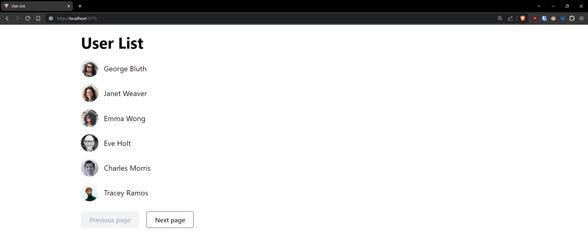
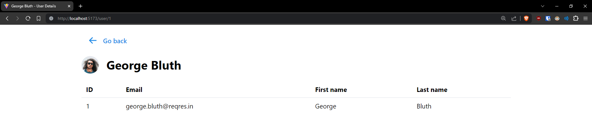

# Front-End Engineer Coding Exercise

A solution to [a front-end engineer technical challenge from Line-Up](https://lineupnow.notion.site/Front-End-Engineer-Line-Up-Coding-Exercise-Junior-66237f2b49c243c5999696a75c9683c5).





## Usage

Install Node:

```bash
curl -L https://git.io/n-install | bash
n auto
```

Install pnpm:

```bash
npm i -g pnpm
```

Install dependencies:

```bash
pnpm i
```

Run development server:

```bash
pnpm dev
```

## Technology

#### Tooling

- [TypeScript](https://www.typescriptlang.org/) for type-checking and type-safety.
- [Prettier](https://prettier.io/) for code formatting.
- [ESLint](https://eslint.org/) for linting and error-checking.
- [Vite](https://vitejs.dev/) for development server.

#### Front-end

- [React](https://reactjs.org/) for user interface, state and components.
- [React Router](https://reactrouter.com/) for routing.
- [React Query](https://react-query.tanstack.com/) for data management.
- [Ky](https://github.com/sindresorhus/ky) from data fetching.
- [Mantine](https://mantine.dev/) for UI.

## License

This project is licensed under the [MIT license](https://opensource.org/license/mit/).
